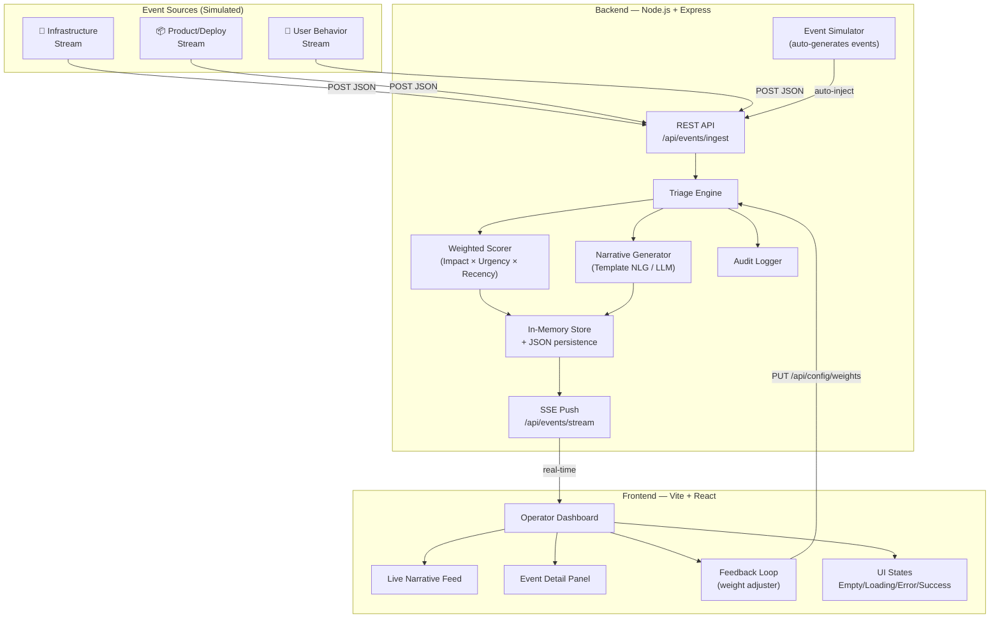

# StoryForge 94 — Product Narrative Studio

A multi-region SaaS event triage system that replaces rules-based noise with AI-powered narrative ranking, surfacing real incidents to operators through a premium dashboard experience.

## User Review Required

> [!IMPORTANT]
> **Gen-AI Strategy**: The plan uses a local heuristic scoring engine + template-based NLG for explanations (zero external API dependency). If you have an **OpenAI / Gemini API key** available, we can swap the explanation generator for real LLM-powered narratives. Please confirm your preference.

> [!IMPORTANT]
> **Deployment Target**: The plan targets `localhost` with Docker-ready config. If you want a live cloud deploy (e.g., Railway, Render, Fly.io), let me know and I'll add deployment scripts.

## Open Questions

1. **API Key for Gen-AI explanations?** — Do you have an OpenAI/Gemini key, or should we use template-based NLG (no external dependency)?
2. **Port preferences?** — Default: backend `:3001`, frontend `:5173`. Any conflicts?

---

## Architecture Overview



---

## Proposed Changes

### Component 1: Backend — Node.js + Express Server

The backend handles event ingestion, scoring, NLG, audit logging, and real-time push via SSE.

#### [NEW] [server.js](file:///e:/Story_Forage94/server/server.js)
Express entry point. Registers routes, middleware (CORS, JSON parsing, error handling), and starts the HTTP server with SSE support.

#### [NEW] [routes/events.js](file:///e:/Story_Forage94/server/routes/events.js)
- `POST /api/events/ingest` — Accepts JSON event batches from any source
- `GET /api/events/stream` — SSE endpoint pushing ranked events in real-time
- `GET /api/events/history` — Returns last N triage decisions (replay capability)
- `GET /api/events/:id` — Single event detail with full audit trail

#### [NEW] [routes/config.js](file:///e:/Story_Forage94/server/routes/config.js)
- `GET /api/config/weights` — Current scoring weights
- `PUT /api/config/weights` — Operator feedback loop: adjust weights live
- `POST /api/config/reset` — Reset to defaults

#### [NEW] [engine/scorer.js](file:///e:/Story_Forage94/server/engine/scorer.js)
Weighted scoring engine implementing:
```
Score = (severity × W_sev) + (userImpact × W_imp) + (recency × W_rec) + (frequency × W_freq)
```
- Normalizes each dimension to 0–1 scale
- Weights are adjustable via the operator feedback loop
- Default weights: `severity: 0.35, impact: 0.30, recency: 0.20, frequency: 0.15`

#### [NEW] [engine/narrator.js](file:///e:/Story_Forage94/server/engine/narrator.js)
Template-based natural-language explanation generator:
- Maps event type + severity + context into human-readable narratives
- Example output: *"Critical: Auth service latency spike affecting 12K users in us-east-1. This correlates with 3 related deployment events in the last 15 minutes."*
- Swappable with LLM-based generator if API key is provided

#### [NEW] [engine/correlator.js](file:///e:/Story_Forage94/server/engine/correlator.js)
Groups related events by service, region, and time window to reduce noise and detect incident clusters.

#### [NEW] [store/eventStore.js](file:///e:/Story_Forage94/server/store/eventStore.js)
In-memory event store with:
- Circular buffer (last 1000 events)
- JSON file persistence for replay (`data/events.json`)
- Query by time range, source, severity

#### [NEW] [store/auditLog.js](file:///e:/Story_Forage94/server/store/auditLog.js)
Structured audit logger recording every processing step:
- Event received → scored → ranked → narrative generated
- Persisted to `data/audit.jsonl` (append-only)

#### [NEW] [simulator/streams.js](file:///e:/Story_Forage94/server/simulator/streams.js)
Three simulated event stream generators:

| Stream | Events | Cadence |
|--------|--------|---------|
| **Infrastructure** | CPU spikes, memory alerts, network errors, disk warnings | Every 3–8s |
| **Product/Deploy** | Deployments, feature flags, rollbacks, config changes | Every 10–20s |
| **User Behavior** | Error rate spikes, login failures, cart abandonment surges, support ticket bursts | Every 5–12s |

Each generator produces well-structured JSON with: `id`, `timestamp`, `source`, `type`, `severity`, `region`, `service`, `metadata`, `userImpact`.

---

### Component 2: Frontend — Vite + React Dashboard

A premium, dark-themed operator dashboard with real-time updates.

#### [NEW] [package.json](file:///e:/Story_Forage94/client/package.json)
Vite + React project with dependencies: `react`, `react-dom`, `lucide-react` (icons).

#### [NEW] [index.html](file:///e:/Story_Forage94/client/index.html)
Entry HTML with Google Fonts (Inter), meta tags, and root mount.

#### [NEW] [src/App.jsx](file:///e:/Story_Forage94/client/src/App.jsx)
Root component orchestrating layout, SSE connection, and global state.

#### [NEW] [src/index.css](file:///e:/Story_Forage94/client/src/index.css)
Design system with:
- Dark theme with deep navy/slate palette (`#0a0e1a`, `#141925`, `#1e2433`)
- HSL-based accent colors (amber for critical, emerald for healthy, rose for errors)
- Glassmorphism cards with `backdrop-filter: blur()`
- Smooth transitions and micro-animations
- CSS custom properties for all design tokens

#### [NEW] [src/components/Header.jsx](file:///e:/Story_Forage94/client/src/components/Header.jsx)
Top bar with: logo, connection status indicator (live/reconnecting/offline), event counter, and system health badge.

#### [NEW] [src/components/NarrativeFeed.jsx](file:///e:/Story_Forage94/client/src/components/NarrativeFeed.jsx)
Main panel — scrollable list of ranked events as narrative cards:
- Priority badge (P1–P4) with color coding
- Source icon (infra/product/user)
- AI-generated explanation text
- Timestamp + region tag
- Score bar visualization
- Click to expand for details

#### [NEW] [src/components/EventDetail.jsx](file:///e:/Story_Forage94/client/src/components/EventDetail.jsx)
Slide-out detail panel showing:
- Full event JSON
- Audit trail timeline
- Correlated events cluster
- Score breakdown (radar chart)

#### [NEW] [src/components/StatsBar.jsx](file:///e:/Story_Forage94/client/src/components/StatsBar.jsx)
Top metrics row: total events, critical count, avg triage time, active sources, noise reduction %.

#### [NEW] [src/components/WeightAdjuster.jsx](file:///e:/Story_Forage94/client/src/components/WeightAdjuster.jsx)
**Bonus feature** — Operator feedback loop:
- Four sliders for scoring weights (severity, impact, recency, frequency)
- Live preview of re-ranked results
- "Apply" button PUTs weights to backend
- "Reset Defaults" button

#### [NEW] [src/components/EmptyState.jsx](file:///e:/Story_Forage94/client/src/components/EmptyState.jsx)
Beautiful empty state with animation — shown when no events have been ingested yet.

#### [NEW] [src/components/ErrorState.jsx](file:///e:/Story_Forage94/client/src/components/ErrorState.jsx)
Error boundary with retry button and clear error message.

#### [NEW] [src/components/LoadingState.jsx](file:///e:/Story_Forage94/client/src/components/LoadingState.jsx)
Skeleton loader with pulse animation during initial data fetch.

#### [NEW] [src/hooks/useEventStream.js](file:///e:/Story_Forage94/client/src/hooks/useEventStream.js)
Custom React hook wrapping `EventSource` API:
- Auto-reconnect with exponential backoff
- Connection state tracking (connected/reconnecting/disconnected)
- Event buffering and deduplication

#### [NEW] [src/hooks/useWeights.js](file:///e:/Story_Forage94/client/src/hooks/useWeights.js)
Hook for fetching/updating scoring weights with optimistic UI updates.

---

### Component 3: Project Configuration & Documentation

#### [NEW] [package.json](file:///e:/Story_Forage94/package.json)
Root workspace package.json with scripts:
- `npm run dev` — starts both server and client concurrently
- `npm run server` — starts backend only
- `npm run client` — starts frontend only
- `npm run simulate` — triggers burst of simulated events

#### [NEW] [README.md](file:///e:/Story_Forage94/README.md)
Setup instructions covering:
- Prerequisites (Node.js 18+)
- Quick start (`npm install && npm run dev`)
- Architecture note with skill ownership table
- Configuration options
- Demo script outline
- API reference

#### [NEW] [ARCHITECTURE.md](file:///e:/Story_Forage94/ARCHITECTURE.md)
Skill ownership table:

| Skill | Owner | Responsibilities |
|-------|-------|-----------------|
| **Design** | Designer | UI/UX, component design, dark theme, micro-animations, user flow |
| **Gen-AI** | AI Engineer | Narrative generation, scoring algorithm, correlation engine |
| **Product Management** | PM | Event taxonomy, priority matrix, feedback loop design, demo script |

#### [NEW] [DEMO_SCRIPT.md](file:///e:/Story_Forage94/DEMO_SCRIPT.md)
Step-by-step demo walkthrough:
1. Start system → show empty state
2. Events begin flowing → loading → success transition
3. Walk through narrative feed → click into detail
4. Demonstrate weight adjustment → show re-ranking
5. Show audit trail
6. Simulate error → show error state + recovery

---

## Tech Stack Summary

| Layer | Technology | Rationale |
|-------|-----------|-----------|
| Backend Runtime | Node.js 18+ | Fast startup, SSE-native, cloud-friendly |
| Backend Framework | Express.js | Minimal, well-understood, fast to build |
| Real-time Push | Server-Sent Events | Unidirectional (server→client), auto-reconnect, HTTP-native |
| Frontend Build | Vite | Instant HMR, fast builds |
| Frontend UI | React 18 | Component model, hooks for SSE integration |
| Styling | Vanilla CSS | Full control for premium design, no framework overhead |
| Icons | Lucide React | Clean, consistent icon set |
| Font | Inter (Google Fonts) | Modern, highly readable at all sizes |
| Persistence | JSON files | Zero-dependency, sufficient for demo |
| Gen-AI | Template NLG | No external API dependency (swappable) |

---

## File Structure

```
e:\Story_Forage94\
├── package.json              # Root workspace
├── README.md                 # Setup + config docs
├── ARCHITECTURE.md           # Skill ownership
├── DEMO_SCRIPT.md            # Demo walkthrough
│
├── server/
│   ├── package.json
│   ├── server.js             # Express entry point
│   ├── routes/
│   │   ├── events.js         # Event CRUD + SSE
│   │   └── config.js         # Weight configuration
│   ├── engine/
│   │   ├── scorer.js         # Weighted scoring
│   │   ├── narrator.js       # NLG explanations
│   │   └── correlator.js     # Event correlation
│   ├── store/
│   │   ├── eventStore.js     # In-memory + persistence
│   │   └── auditLog.js       # Audit trail
│   ├── simulator/
│   │   └── streams.js        # 3 event generators
│   └── data/                 # Persisted state (gitignored)
│
└── client/
    ├── package.json
    ├── index.html
    ├── vite.config.js
    └── src/
        ├── main.jsx
        ├── App.jsx
        ├── index.css          # Design system
        ├── components/
        │   ├── Header.jsx
        │   ├── NarrativeFeed.jsx
        │   ├── EventDetail.jsx
        │   ├── StatsBar.jsx
        │   ├── WeightAdjuster.jsx
        │   ├── EmptyState.jsx
        │   ├── ErrorState.jsx
        │   └── LoadingState.jsx
        └── hooks/
            ├── useEventStream.js
            └── useWeights.js
```

---

## Verification Plan

### Automated Tests
```bash
# 1. Install dependencies
npm install

# 2. Start the full stack
npm run dev

# 3. Verify event ingestion via curl
curl -X POST http://localhost:3001/api/events/ingest \
  -H "Content-Type: application/json" \
  -d '[{"source":"infrastructure","type":"cpu_spike","severity":4,"region":"us-east-1","service":"auth-service","metadata":{"cpu_percent":95},"userImpact":8500}]'

# 4. Check ranked output
curl http://localhost:3001/api/events/history

# 5. Check weights API
curl http://localhost:3001/api/config/weights

# 6. Verify SSE streaming
curl -N http://localhost:3001/api/events/stream
```

### Manual Verification
- **UI States**: Verify empty → loading → success → error transitions
- **Real-time Updates**: Confirm events appear in <2s via SSE
- **Narrative Quality**: Read generated explanations for clarity
- **Weight Adjustment**: Move sliders, verify re-ranking
- **Audit Trail**: Click event detail, verify processing steps
- **Performance**: Confirm batch triage < 5 seconds
- **Error Recovery**: Stop server, verify error state, restart, verify reconnection

### Performance Target
- End-to-end triage path (ingest → score → rank → narrate → push) completes within **5 seconds** for a batch of 50 events
